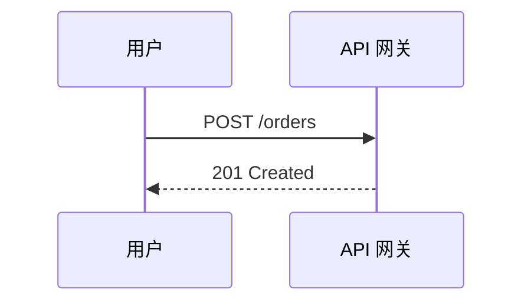
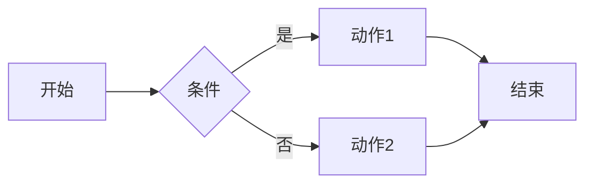
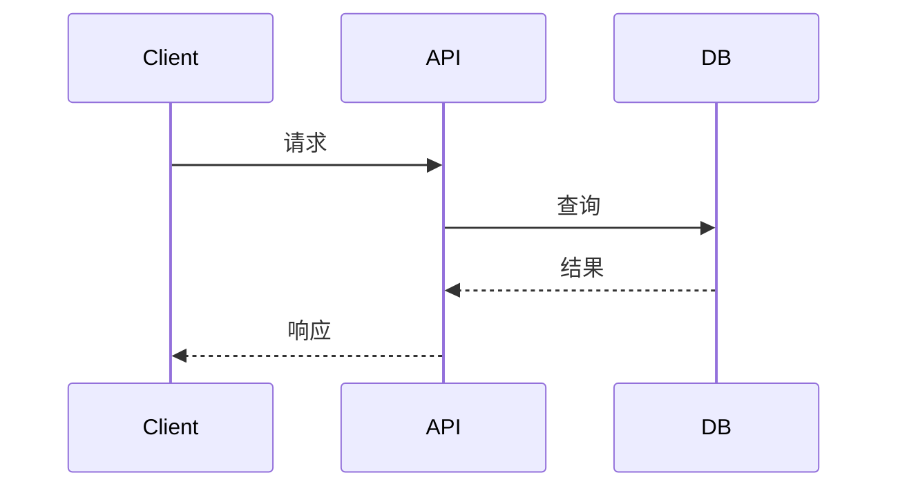
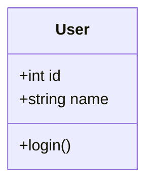
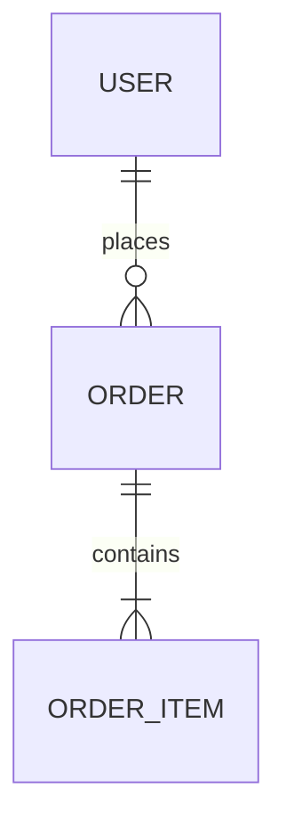
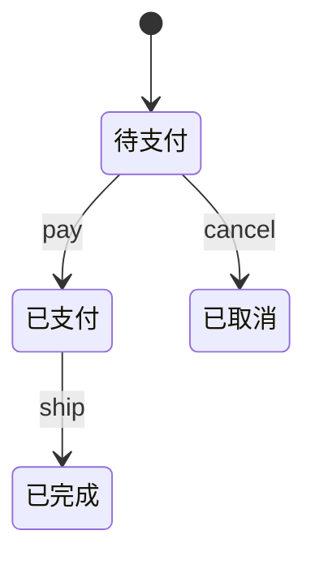
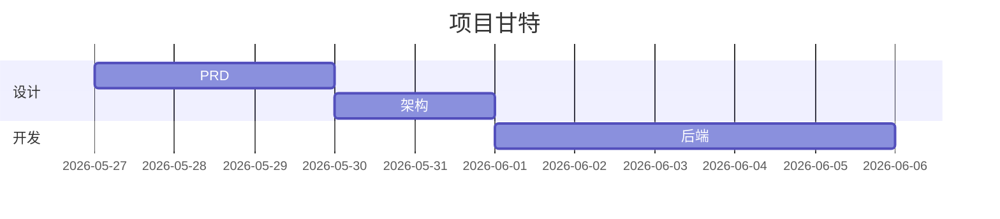

# 绘图规范（Diagramming Standards）

> 一图胜千言，但前提是**画对图**。本文档规定 product-lifecycle 体系里何时画图、画什么图、用什么工具、怎么避免常见坑。

## 1. 工具优先级（双轨策略）

| 优先级 | 工具 | 使用场景 | 输出 |
|--------|------|---------|------|
| ⭐⭐⭐ | **drawio MCP** | 复杂图、需要美观、最终交付物、有云架构图标 | `.drawio` / `.svg` / `.png` |
| ⭐⭐ | **Mermaid** | 嵌入 markdown、轻量草图、版本可控、CI 友好 | ` ```mermaid ` 代码块 |
| ⭐ | ASCII art | 极简提示、终端展示、纯文本环境 | 等宽字符 |

**默认策略**：

- **进 PRD / 架构正式文档**：用 drawio MCP 生成 SVG，把 SVG 放到 `assets/`，markdown 用 `` 引用
- **快速沟通 / 设计思考过程**：用 Mermaid 直接嵌入
- **drawio MCP 不可用**（离线 / CI 环境）：自动降级到 Mermaid

### 1.1 drawio MCP 启用方式

仓库根目录已配置 `.mcp.json`，Claude Code 在本仓库内**自动加载**。其它场景：

```bash
# 用户级（任意项目都可用）
bash scripts/install-mcp.sh

# Cursor：把 .cursor/mcp.json 合并到 ~/.cursor/mcp.json

# 临时手动
claude mcp add drawio -- npx -y @next-ai-drawio/mcp-server@latest
```

调用示例（在 AI 对话里）：

> 用 drawio 给我画一张电商订单系统的时序图，包含用户、网关、订单服务、支付服务、库存服务、消息队列六个泳道，覆盖下单 → 支付成功 → 异步扣减库存全流程。

AI 会生成 draw.io XML，可保存为 `.drawio` 文件或导出 `.svg`。

### 1.2 Mermaid 何时优先

- 文档主要是文字，图只是辅助
- 团队需要在 Markdown 里 review 图（PR diff 可见）
- 流程简单（< 20 节点）



## 2. 11 种典型图与适用场景

按"先想要表达什么，再选图类型"原则。

### 2.1 业务/需求层

| 图 | 用途 | 关键要素 | 谁画 |
|----|------|---------|------|
| **用户旅程图**（User Journey） | 端到端体验、痛点高峰 | 阶段、用户行为、想法、痛点、机会 | product-manager · ui-designer |
| **用例图**（Use Case） | 功能边界、Actor 关系 | Actor、用例、`<<include>>`、`<<extend>>` | product-manager |
| **信息架构图**（IA / 站点图） | 页面/功能层级 | 树状结构、导航关系 | ui-designer · product-manager |
| **故事地图**（Story Map） | Backlog 可视化 | 主线、迭代版本切片 | product-manager · iteration-planner |

### 2.2 系统/架构层

| 图 | 用途 | 关键要素 | 谁画 |
|----|------|---------|------|
| **系统上下文图**（C4-L1） | 系统边界、外部依赖 | 当前系统 + 外部用户/系统 | architect |
| **容器图**（C4-L2） | 部署单元、技术栈 | Web / API / DB / 缓存 + 通信协议 | architect |
| **组件图**（C4-L3） | 模块内部 | 模块、依赖、接口 | architect · backend/frontend |
| **部署架构图** | 物理/云部署 | VPC、子网、ELB、ECS/K8s、RDS 等 | architect · devops |
| **网络拓扑图** | 网络分层 | 公网/内网/DMZ、防火墙、路由 | devops · security |

### 2.3 流程/行为层

| 图 | 用途 | 关键要素 | 谁画 |
|----|------|---------|------|
| **流程图**（Flowchart） | 业务流程、决策分支 | 矩形（动作）、菱形（判断）、起止 | 所有人 |
| **时序图**（Sequence） | 跨服务时间顺序 | 泳道、消息、激活条 | architect · backend-developer |
| **活动图**（Activity） | 并行流程 / fork-join | swimlane、fork/join、决策 | backend-developer · qa |
| **状态机图**（State Machine） | 对象状态流转 | 状态、迁移、守卫条件 | backend-developer · frontend |

### 2.4 数据层

| 图 | 用途 | 关键要素 | 谁画 |
|----|------|---------|------|
| **ER 图** | 数据模型 | 实体、属性、关系（1:1/1:N/N:M） | dba · backend-developer |
| **数据流图**（DFD） | 数据流动 | 数据源、流转、存储、加工 | architect · data-analyst |
| **桑基图** / 漏斗 | 转化、流量分配 | 节点宽度=量级 | data-analyst |

### 2.5 项目/质量层

| 图 | 用途 | 关键要素 | 谁画 |
|----|------|---------|------|
| **甘特图** | 任务时间安排 | 任务、起止、依赖、里程碑 | project-manager |
| **依赖关系图** | 任务/模块依赖 | 节点 + 有向边 + 关键路径高亮 | project-manager · architect |
| **威胁建模图**（STRIDE） | 攻击面 | 信任边界、数据流、威胁标注 | security-engineer |
| **鱼骨图**（Ishikawa） | 根因分析 | 鱼头=问题，刺=因素分类 | feedback-analyst · qa |
| **思维导图**（Mind Map） | 头脑风暴、测试覆盖 | 中心节点 + 多级分支 | qa-manager · product-manager |

## 3. 角色 × 图 必画清单

每个角色在产出关键文档时**至少**画下面这些图。打 ✅ 表示必画，⚪ 表示按需。

| 角色 | 流程 | 时序 | ER | 架构 | 部署 | 用例 | 状态机 | 旅程 | 甘特 | 威胁 | 思维 |
|------|:---:|:---:|:--:|:---:|:---:|:---:|:------:|:---:|:----:|:----:|:----:|
| orchestrator | ⚪ | – | – | – | – | – | – | – | ✅ | – | ⚪ |
| project-manager | ⚪ | – | – | – | – | – | – | – | ✅ | – | – |
| market-analyst | – | – | – | – | – | – | – | ⚪ | – | – | ⚪ |
| product-manager | ✅ | – | – | – | – | ✅ | – | ✅ | – | – | ⚪ |
| ui-designer | ✅ | – | – | – | – | ⚪ | ⚪ | ✅ | – | – | – |
| architect | – | ✅ | – | ✅ | ✅ | – | – | – | – | ⚪ | – |
| backend-developer | ⚪ | ✅ | ⚪ | ⚪ | – | – | ✅ | – | – | – | – |
| frontend-developer | ⚪ | – | – | ⚪ | – | – | ✅ | – | – | – | – |
| dba | – | – | ✅ | – | – | – | – | – | – | – | – |
| devops | ⚪ | – | – | – | ✅ | – | – | – | – | ⚪ | – |
| qa-manager | ✅ | ⚪ | – | – | – | – | ⚪ | – | – | – | ✅ |
| security-engineer | – | – | – | – | ⚪ | – | – | – | – | ✅ | – |
| data-analyst | ✅ | – | – | – | – | – | – | – | – | – | ⚪ |
| feedback-analyst | – | – | – | – | – | – | – | ⚪ | – | – | ⚪ |
| docwriter | ⚪ | ⚪ | – | ⚪ | – | – | – | – | – | – | – |
| reviewer / quality-gatekeeper | 看产出物自身需要的图 | | | | | | | | | | |

## 4. 文档 → 图 对应表

PRD、架构、QA 等关键文档**必须包含**的图（CI 会检查）：

| 文档类型 | 必含图（最少） | 建议图 |
|---------|--------------|--------|
| **PRD**（product_template） | 用户旅程图 + 主要流程图 | 用例图、信息架构 |
| **架构设计**（architecture_template） | 系统上下文 + 容器图 + 1 张关键时序图 | 组件图、部署图 |
| **数据库设计** | ER 图 | 索引/分片示意图 |
| **API/后端**（backend_template） | 时序图（关键链路） + 状态机（核心实体） | 组件图 |
| **前端**（frontend_template） | 组件层级图 + 关键状态机 | 路由图 |
| **UI/UX**（ui_design_template） | 信息架构 + 用户旅程 + 关键页面线框 | 组件库示意 |
| **测试计划**（qa_template） | 测试用例脑图 + 关键流程图 | – |
| **安全审计**（security_template） | 威胁建模图（STRIDE） | 信任边界图 |
| **数据分析**（data_template） | 漏斗图 / 桑基图 | 数据流图 |
| **项目计划**（pmo_template） | 甘特图 + 依赖关系图 | 里程碑路线图 |
| **运维部署** | 部署架构图 + CI/CD 流水线图 | 网络拓扑 |

## 5. 通用画图规范

### 5.1 命名与组织

```
docs/iterations/current/
├── product/PRD-001-产品需求.md
└── product/assets/
    ├── PRD-001-user-journey.drawio   ← 源文件
    ├── PRD-001-user-journey.svg      ← 给 markdown 引用
    └── PRD-001-flow-checkout.svg
```

- 一个文档的图统一放在同级 `assets/` 目录
- 文件名前缀对齐文档编号：`<文档ID>-<图类型>-<语义名>.svg`
- 同时保存 `.drawio` 源 + `.svg` 渲染版本

### 5.2 视觉规范（drawio 默认即可）

| 元素 | 规范 |
|------|------|
| 颜色 | 信息<6 种主色；状态用红黄绿；不要彩虹 |
| 线条 | 数据流实线，控制流虚线，错误路径红色 |
| 字号 | 标题 16-20，节点 12-14，标签 10-12，全图统一 |
| 对齐 | 严格网格对齐；元素间距≥20px |
| 方向 | 流程图自上而下或左到右，**全文统一** |
| 标题 | 每图必须有标题 + 简短描述（图下方 1-2 行） |

### 5.3 嵌入 markdown

```markdown
### 下单时序图

订单从创建到支付的完整流转。失败分支见图右侧。


> 源文件：[`PRD-001-seq-order.drawio`](assets/PRD-001-seq-order.drawio)
```

## 6. 反模式（**别这样画**）

| 反模式 | 问题 | 正确做法 |
|--------|------|---------|
| 一张图塞 50+ 节点 | 信息过载，看不出重点 | 按 C4 分层；超过 15 节点强制拆 |
| 没标题、没图例 | 读者猜不出含义 | 每图必须有标题 + 关键符号说明 |
| 颜色乱用 | 红/绿无规律，分不清状态 | 状态色统一：成功绿/警告黄/错误红 |
| 文字盖在线上 | 难读 | 标签放线条上方，留白 |
| 既画方框又画云朵又画圆角 | 形状无意义 | 形状语义化：矩形=进程、圆=起止、菱形=判断、云=外部 |
| 流向忽上忽下 | 阅读跳跃 | 主流方向统一 |
| 跨页大图 | 打印/截图不可用 | 拆图或用 C4 多层级 |
| 没版本号 | 改了不知道哪版 | 文件名带迭代号；源文件进 git |

## 7. Mermaid 速查（备用）













完整语法见 [Mermaid 官方文档](https://mermaid.js.org)。

## 8. 何时**不**画图

- 一句话能讲清楚（"用 Redis 缓存订单状态"）
- 流程只有 2-3 步（直接用列表）
- 信息会快速过期（如某次 debug 的临时拓扑）
- 受众只关心结论，不关心机制

**画图成本不低**——画得不好不如不画。判断标准：**3 个月后回来看，图还能帮我快速理解吗？**

## 9. 集成到工作流

在 Agent 任务里，绘图作为产出物的一部分：

1. **写文档前**：先想"这个文档要传递什么信息？需要图吗？"
2. **写正文时**：在该插图位置先写占位 `<!-- TODO drawio: 时序图-下单流程 -->`
3. **正文完成后**：批量调 drawio MCP 把占位变成 SVG
4. **CI 检查**：`bash scripts/check-diagrams.sh` 校验是否覆盖第 4 节的「文档→图」要求
