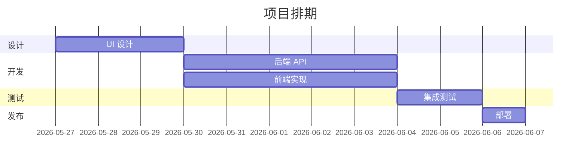

# [PMO-编号] 项目计划

> 💡 推荐先读 skill：`writing-plans`、`dispatching-parallel-agents`

| 字段 | 值 |
|------|-----|
| 版本 | v0.1（初稿） |
| 作者 | 项目经理 |
| 日期 | YYYY-MM-DD |
| 状态 | 草稿 / 执行中 / 已完成 |
| 关联文档 | WORKFLOW_PLAN、PRD-xxx、ITER-xxx |

---

## 1. 项目概述 [必填]

### 1.1 目标与范围
> 本次项目 / 迭代的目标、范围、约束。

### 1.2 团队
| 角色 | 负责人 |
|------|--------|

### 1.3 关键日期
| 事件 | 日期 |
|------|------|
| 启动 | YYYY-MM-DD |
| 设计完成 | YYYY-MM-DD |
| 开发完成 | YYYY-MM-DD |
| 测试完成 | YYYY-MM-DD |
| 上线发布 | YYYY-MM-DD |

## 2. 任务分解（WBS） [必填]

| 任务 ID | 标题 | 负责角色 | 依赖 | 估时 | 优先级 | 验收标准 |
|---------|------|----------|------|------|--------|----------|

## 3. 里程碑 [必填]

| 编号 | 名称 | 日期 | 交付物 | 验收标准 | 负责人 |
|------|------|------|--------|----------|--------|

## 4. 排期甘特图 [必填]



## 5. 依赖关系 [必填]

```
[任务 A] → [任务 B]
         ↘
           [任务 D]
[任务 C] →
```

## 6. 风险登记 [必填]

| ID | 风险描述 | 概率 | 影响 | 暴露度 | 缓解措施 | 负责人 | 状态 |
|----|----------|------|------|--------|----------|--------|------|

> 暴露度 = 概率(1-3) × 影响(1-3)，≥6 必须有缓解。

## 7. 沟通计划 [必填]

| 类型 | 频率 | 参与 | 形式 | 产出 |
|------|------|------|------|------|
| 站会 | 每日 | 全员 | 异步消息 | 阻塞清单 |
| 周报 | 每周 | 全员 + stakeholder | 文档 | 进度报告 |
| 评审 | 里程碑 | 决策人 | 会议 | 决议 |

## 8. 进度跟踪 [必填，持续更新]

### 8.1 整体进度
> `[████████░░] 80%`

### 8.2 任务状态
| 任务 | 负责 | 计划完成 | 实际进度 | 状态 |
|------|------|----------|----------|------|

### 8.3 当前阻塞
> 列出当前所有阻塞项 + 等待解锁的条件。

### 8.4 风险变化
> 本周新增 / 升级 / 关闭的风险。

## 9. 变更记录 [必填]

| 日期 | 变更类型 | 内容 | 影响 | 决策人 |
|------|----------|------|------|--------|

## 10. 修订记录 [必填]

| 版本 | 日期 | 作者 | 变更说明 |
|------|------|------|----------|
| v0.1 | YYYY-MM-DD | 项目经理 | 初稿 |

## 图示要求 [必填]

> 完整规范见 `docs/05-advanced/DIAGRAMMING.md`。优先用 **drawio MCP** 生成 SVG，放到同级 `assets/` 下。

**本类文档至少包含：**

甘特图（必）、依赖关系图（必）；里程碑路线图（建议）

**嵌入语法：**

```markdown

> 源文件：`assets/<文档ID>-<图类型>.drawio`
```

**离线 / 简图可降级 Mermaid**（```mermaid 代码块）。
